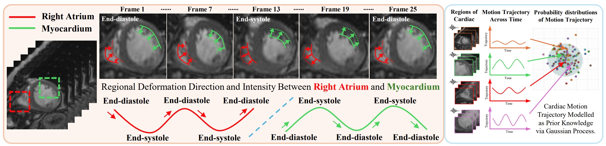

# NIPS2024: Bidirectional Recurrence for Cardiac Motion Tracking with Gaussian Process Latent Coding

This repository is the official implementation of "Bidirectional Recurrence for Cardiac Motion Tracking with Gaussian Process Latent Coding".


## Requirements
Please use command
```
conda env create -f environment.yaml
```
to install the environment.

## Data
* We used 3D Echocardiogram video for training: [CardiacUDA dataset](https://github.com/xmed-lab/GraphEcho)
* We used 4D cardiac MR images for training: [ACDC dataset](https://www.creatis.insa-lyon.fr/Challenge/acdc/)

## Training

For CardiacUDA, to run training process:

```
python train_cardiauda.py
```

For ACDC, to run training process:

```
python train_acdc.py
```

## Test

To run testing process:

```
python3 test_cardiacuda.py
```

or

```
python3 test_acdc.py
```

You need to replace the pretrained weight according to different datasets in files.

## Acknowledgement

We would like to thank the great work of the following open-source project: 

[DiffuseMorph](https://github.com/DiffuseMorph/DiffuseMorph).
[FSDiffReg](https://github.com/xmed-lab/FSDiffReg/tree/master).
[DeepTag](https://github.com/DeepTag/cardiac_tagging_motion_estimation).


## Citation

```
@article{yang2024bidirectional,
  title={Bidirectional Recurrence for Cardiac Motion Tracking with Gaussian Process Latent Coding},
  author={Yang, Jiewen and Lin, Yiqun and Pu, Bin and Li, Xiaomeng},
  journal={Advances in Neural Information Processing Systems},
  volume={37},
  pages={34800--34823},
  year={2024}
}
```